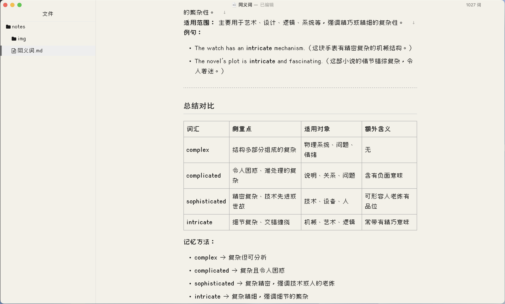

# **Cubic11 Typewriter · Typora 主题**

> **“像上世纪的打字机一样，敲出每一行文字。”**

Cubic11 Typewriter 是一个为 [Typora](https://typora.io) 设计的轻量级 Markdown 主题，灵感来自 20 世纪中期的机械打字机文档风格。

主题使用系统字体 **Cubic11**，无需额外字体文件，适合写作、小说、剧本与笔记。

______

## **🖋️ 主题特点**

- **打字机视觉风格**
  - 仿旧纸张底色
  - 单色碳带黑文字
  - 宽松行距 + 等宽感排版
- **Cubic11 字体**
  - 自动调用系统中已安装的 Cubic11
  - 未安装时自动回退到系统等宽字体
- **专注写作**
  - 无多余装饰
  - 窄栏阅读布局
  - 适合长时间书写

______

## **📦 安装方法**

### **方法一：手动安装**

1. 下载或克隆本仓库

2. 将 cubic-typewriter.css 复制到 Typora 的主题目录：

   - Windows

     ```纯文本
     C:\Users\你的用户名\AppData\Roaming\Typora\themes
     ```

   - macOS

     ```纯文本
     ~/Library/Application Support/Typora/themes
     ```

   - 重启 Typora

   - 菜单栏选择：

     ```纯文本
     主题 → cubic-typewriter
     ```

______

## **🔤 字体说明**

本主题默认使用系统字体 **Cubic11**。

- 如果你没有[安装 Cubic11](https://github.com/ACh-K/Cubic-11)：
  - 主题会自动回退到系统等宽字体
  - 建议安装以获得最佳效果

______

## **📸 预览效果**

> 

______

## **🛠️ 自定义建议**

你可以根据需要修改 cubic-typewriter.css 中的变量：

```css
:root {
  --bg-color: #f4f1e8;      /* 纸张颜色 */
  --text-color: #1a1a1a;    /* 文字颜色 */
  --line-height: 1.8;       /* 行距 */
}
```

______

## **🙌 致谢**

- 字体：Cubic11
- Markdown 编辑器：[Typora](https://typora.io)
